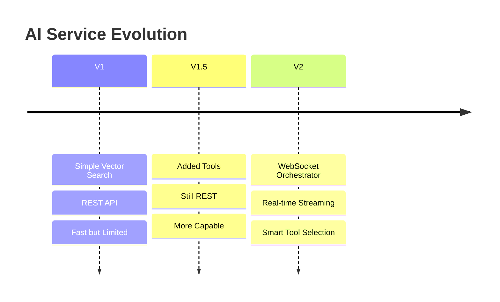
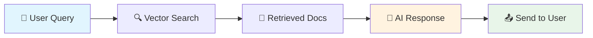
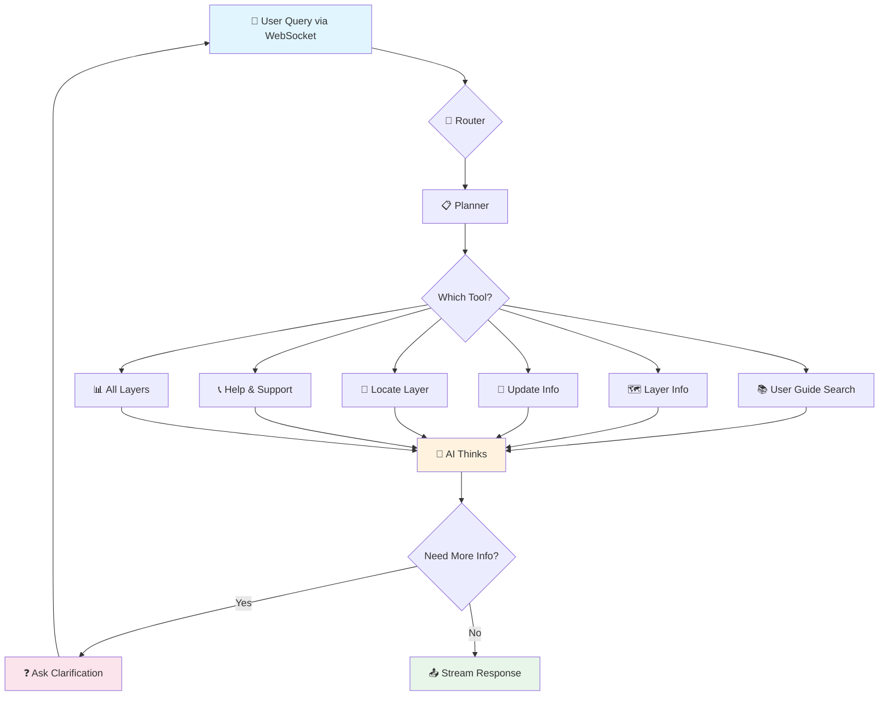
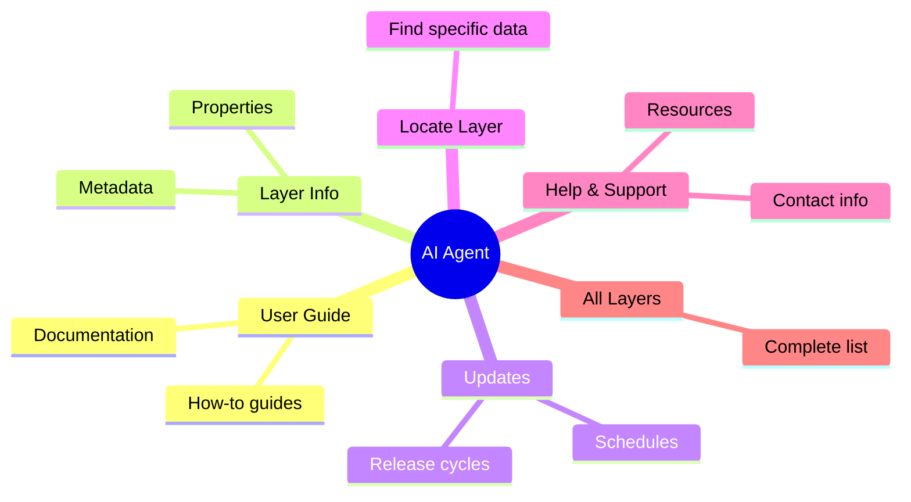
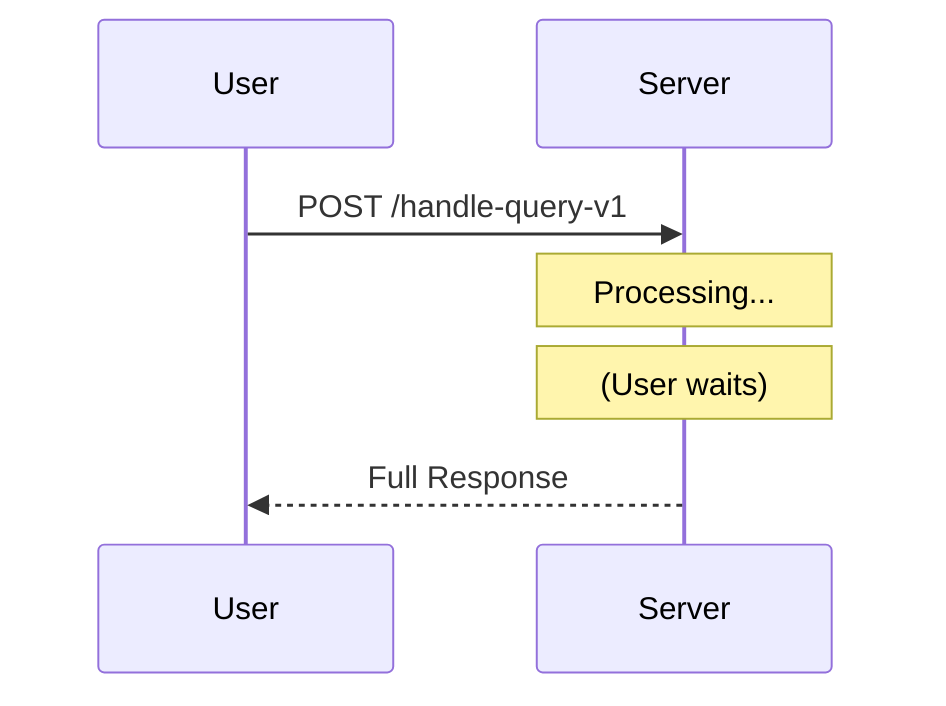
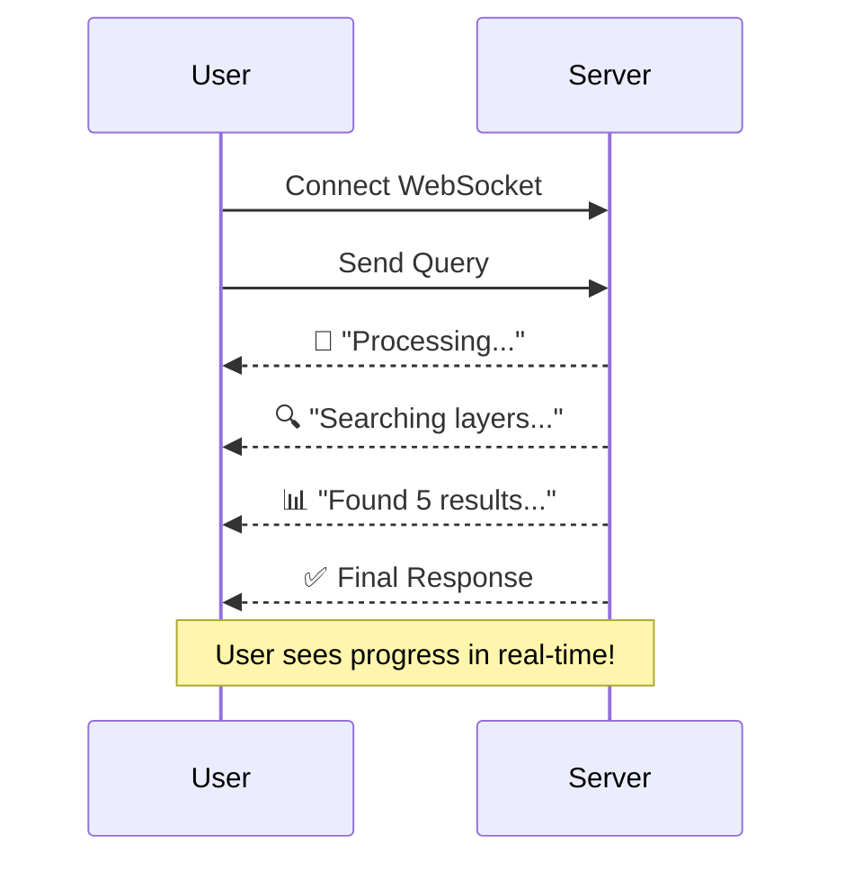
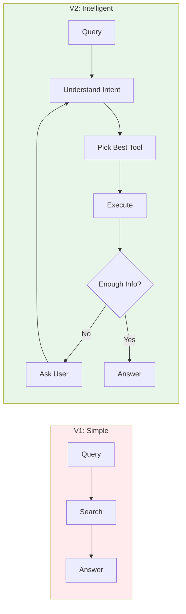

# AI Service Evolution: V1 → V2

---

## 🚀 The Journey

---

## 📦 V1: The Simple Approach

### How it worked

### Characteristics
- ✅ **Fast** - Single API call
- ✅ **Simple** - Just search & respond
- ❌ **Limited** - Can only answer from stored docs
- ❌ **No context** - Doesn't understand intent

---

## 🧠 V2: The Smart Orchestrator

### How it works now

---

## 🔧 The Tools Available

---

## ⚡ Real-time Communication

### V1: Request-Response

### V2: WebSocket Streaming

---

## 🤔 The Thinking Process

